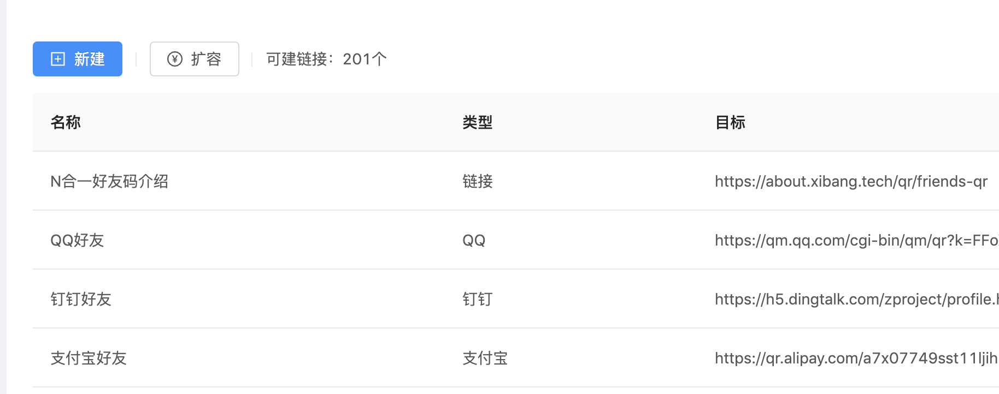
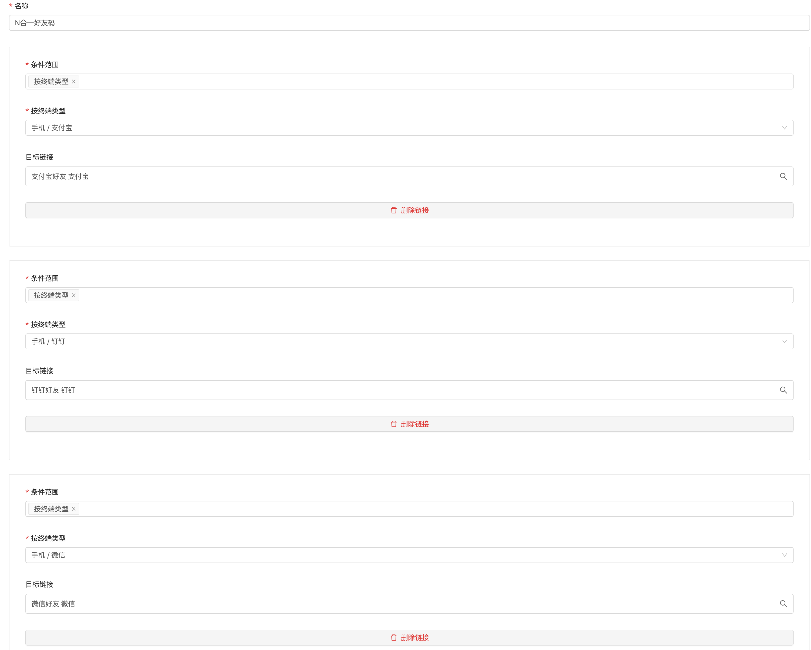

# 创建N合一好友码

视频优酷教程： [https://v.youku.com/v\_show/id\_XNDI4MTQ1NDQzNg==.html](https://v.youku.com/v_show/id_XNDI4MTQ1NDQzNg==.html)

### 创建N个目标链接

分别将支付宝、微信和QQ、和钉钉好友二维码上传并自动识别。

### 创建好友码（活码）

参考上图，创建N个目标链接，条件范围均按终端类型进行判断。

### 效果演示

效果演示，可以分别用不同的客户端扫描以下的付款码二维码：

### 进阶使用

可以将二维码活码链接（URL），提供二维码生成工具，生成你想要的个性化二维码图案。

同时，还可以添加不同的好友二维码，进行随机引流，以实现多客服引流分配。甚至还可以设置概率，分配各个好友的权重，进行按权重引流等。

### 衍生使用场景

#### N合一加群码

* 用钉钉扫码加钉钉群
* 用微信扫码加微信群
* 用QQ扫码加QQ群
* 还可以添加多个群二维码，根据访客地区、时间等条件灵活分配

#### 三合一付款码

* 用微信扫码微信支付
* 用QQ扫码QQ钱包支付
* 用支付宝扫码支付宝支付
* 其他方式扫码文字提示或跳转链接

网站链接：[https://qr.xibang.tech](https://qr.xibang.tech)

