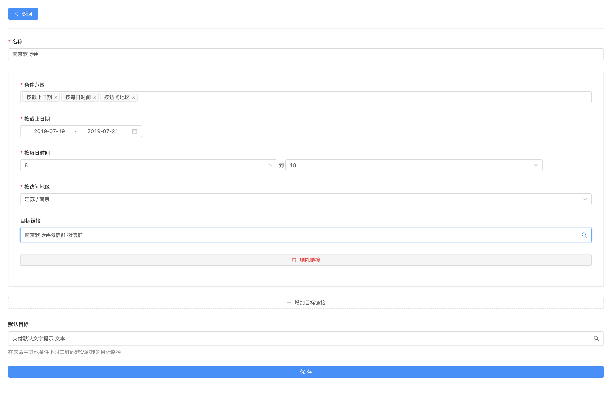
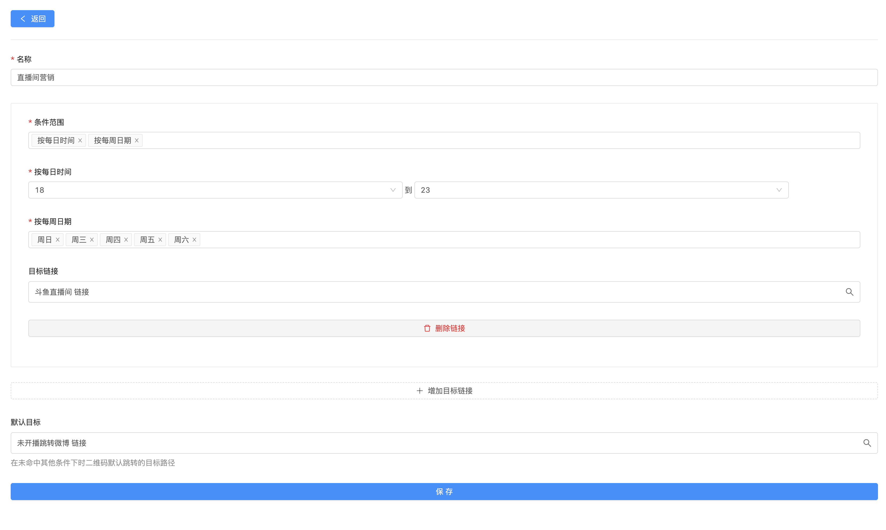

# 更多场景、玩法

### 研讨会、峰会现场群

假设峰会时间为7月19日至21日，每天8点到18点开馆，地区为南京。可以按照上图的示例，添加一条三个条件的目标链接，在条件范围内的扫码访问可以加群，其他时间、访问可以用提示文字或者其他广告链接替代。

同时，还可以进一步设置访问终端类型，分别去加入QQ群、微信群、钉钉群等。

### 省内营销客户群

以江苏省为例，创建14个地区的群链接。在创建活码的时候使用按地区访问条件，分别将南京、苏州、连云港……等地区的访客引入到各自对应的区域群中。


还可以加入终端识别，目前终端识别可以选择具体的扫码应用程序，如QQ、微信、支付宝、钉钉。同时，创建链接也能够自动识别微信、微信群、QQ、QQ群、钉钉、钉钉群、微信支付、支付宝、QQ钱包等。


### 全国营销推广群

与省内类似，创建全国34地区的推广目标链接，分别选择对应的访问地区即可（如江苏，可以选择全江苏作为目标）。

### 扫码进直播间

以主播为例，假设每周二到周日晚上18点到24点进行直播，可以创建一个这样的二维码。

* 每周二到周日晚上18点到23点时间段访问跳转到直播间链接；
* 其他时间访问跳转到主播的微博主页。

